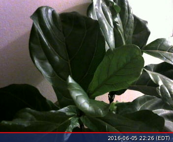

# @grow_slow


This is a guide to making your own version of [@grow_slow](http://twitter.com/grow_slow), which tweets a photo of a plant once a day. Of course, you can use this to do whatever you want — **these instructions will cover the technical aspects of using a Raspberry Pi to take a photo with a webcam and tweet it once a day**. This is written to be understandable for people who might not have a lot of experience with coding, or with Raspberry Pi. You can read more about [@grow_slow](http://twitter.com/grow_slow) [here](http://nicole.pizza/grow_slow).

## Things You Need

* Raspberry Pi
* Wifi module (might be included with your Pi)
* USB Webcam^^
* a plant
* External monitor^
* External keyboard^
* External USB mouse^
* HDMI cable^

^if it's your first time using a Pi, you should use these things, but they're not required

^^note that this guide is for using a USB webcam - if you are using a Raspberry Pi camera module, the webcam instructions are not covered here

## 1. Setting up your Pi

A Raspberry Pi is a tiny computer that can do many things. They're nice because you can just leave them running somewhere in your house, and whatever weird art project you're doing won't rely on your own computer being open or connected.

For our purposes, we will use the Pi to take photos with a webcam and tweet them. 

[Follow this guide](https://www.raspberrypi.org/help/quick-start-guide/) to set up your Pi for the first time, plugging it in to your monitor with your HDMI cable, and also plugging in the keyboard and mouse. Then, [connect your Pi](https://www.raspberrypi.org/documentation/configuration/wireless/) to your wifi network.

### Optional but recommended: SSH

Especially if it's your first time, it's nice and easy to be able to plug your Pi into a monitor and use it that way. However, if you don't want to pull out your keyboard, monitor and mouse every time you want to change something, and more importantly, if your webcam is in an inconvenient place for you to also plug in your monitor, you'll want to set up SSH access.

What SSH allows is for you to control your Raspberry Pi from another computer, which is much more convenient. However, you'll be running things entirely from your [command line](https://en.wikipedia.org/wiki/Command-line_interface) (Terminal on a Mac, or Command Prompt on a PC). If you don't have much or any experience with it, it can be a little confusing, but this can be good practice. If you are comfortable with the command line, it's highly recommended that you set up SSH. [You can follow this guide to do so](https://www.raspberrypi.org/documentation/remote-access/ssh/). 

## 2. Setting the date

Now that your Pi is up and running, open the Terminal from the toolbar at the top, or log in via SSH. You should see something that looks like this:

`pi@raspberrypi ~ $`

We're going to set the date so that our Pi is on the right time.

Type this in and press enter:

`date`

You should get something formatted like "Wed 6 Jun 20:11:24 EDT 2016." And if it's correct, then hooray, you don't have to do anything else. If it's not, enter:

`tzselect`

and follow the instructions to set your timezone. Once you've done it you can confirm by entering `date` again and it should be correct.

##3. Set up the webcam

In order to get the webcam working with the Pi, we're going to install a package called `fswebcam`:

`sudo apt-get install fswebcam`

With the USB camera plugged in, we can very easily take photos via the command line:

`fswebcam test.jpg`

Now, if you click on File Manager, you'll see that in your /home/pi directory, you have a file called test.jpg:



## 4. Setting up Twitter and Twython

If you haven't already, make a Twitter account for your little plant bot. Then, go to https://apps.twitter.com, click "key and access tokens," and generate them. If you're doing this with your Pi connected to a monitor, it's probably easiest to do it through the Pi's web browser. 

In Terminal, run these commands to install the Python package we need to tweet, called Twython:

```
sudo apt-get install python-setuptools
sudo easy_install pip
sudo pip install twython
```

## 5. Making the Python script

Now we are going to write the script that will actually run once a day and tweet our photo. It's the one in this repository called [grow_slow.py](https://github.com/nicolehe/grow_slow/blob/master/grow_slow.py)

Probably the easiest way to do that is to copy that script, and paste it into a file on your own Pi. Go to [raw script URL](https://raw.githubusercontent.com/nicolehe/grow_slow/master/grow_slow.py), and copy it.

Then, in Terminal, make your own file called "grow_slow.py":

`nano grow_slow.py`

This will open a text editor called nano inside the command line. Paste the script in.

This script is written in the programming language Python, and every line with a # in front of it is a comment, which means that it'll be ignored by the computer. 

There should be lines that look like this in the code you just pasted:

```python
CONSUMER_KEY = 'your consumer key here'
CONSUMER_SECRET = 'your consumer secret here'
ACCESS_KEY = 'your access key here'
ACCESS_SECRET = 'your access secret here'
```
Go find the keys you just generated on Twitter and paste the relevant things inside the quotes. Hit ctrl + x to save and exit.

Now, we should be ready to try to tweet! Run:

`python grow_slow.py`

Go to your Twitter account and check — if all went well, it should have tweeted a photo from your webcam.

## 6. Make it cron

Now that we got the Pi to take a photo and tweet it (woohoo!), we want to schedule it so that it runs once a day at the same time. Remember how we set the correct time for our Pi? This is why.

To do this, we'll use something called cron, which is basically a task scheduler. [RaspberryPi.org has some good explanation about how this works](https://www.raspberrypi.org/documentation/linux/usage/cron.md).

Let's open up our crontab:

`crontab -e`

This is the structure of the crontab:

```
# m h  dom mon dow   command
# * * * * *  command to execute
# ┬ ┬ ┬ ┬ ┬
# │ │ │ │ │
# │ │ │ │ │
# │ │ │ │ └───── day of week (0 - 7) (0 to 6 are Sunday to Saturday, or use names; 7 is Sunday, the same as 0)
# │ │ │ └────────── month (1 - 12)
# │ │ └─────────────── day of month (1 - 31)
# │ └──────────────────── hour (0 - 23)
# └───────────────────────── min (0 - 59)
```

If you want your plant to tweet at 10:17 am every morning (like what [@grow_slow](http://twitter.com/grow_slow) does), add this line:

`17 10 * * * /home/pi/grow_slow.py`

You can of course change it to whatever you want. If you wanted it to run more than once a day, you could add multiple lines with different times. Or, if you wanted it to run once a week, you could do that as well. It's up to you!

Hit ctrl + x to save and quit again.

(To see if this works, you can try setting it for a time a few minutes from now and then check if it tweeted properly.)

###Optional but recommended: set a reboot

Sometimes, things can get messed up if your Pi is just constantly running forever. Also, some USB cameras have weird compatibility issues that are solved with a simple reboot. I recommend that you add another simple script that reboots your Pi once a day before your script runs so that things are always fresh, as they say.

Make a file called reboot.sh:

`nano reboot.sh`

Type this in the file:

`sudo reboot`

Hit ctrl + x to save and quit. Now, open up your crontab again with `crontab -e` and add a line that runs your reboot script once a day:

`0 10 * * * /home/pi/reboot.sh`

This sets it to reboot at 10:00 am every morning.

## 7. Position your webcam, and then do whatever you want

Maybe the hardest part of this whole thing is finding a good place to put your webcam so that it captures your plant properly. You'll probably have to take a bunch of test photos to figure out the ideal position.

But once this is all set up, it's yours to experiment with. You can change the frequency of the photos, or give the photo names a timestamp, or upload each photo onto a server, or tweet words as well as photos, or instead of taking photos of your plant take photos of your piano, or window, or bed, or aquarium, or whatever. There are many ways to build upon this project.

Feel free to submit pull-requests to improve this (very simple) script! 

And if you do set up a tweeting plant, please [let me know](mailto:hi@nicole.pizza)! Maybe one day we will have an internet garden. :seedling::seedling::seedling:


